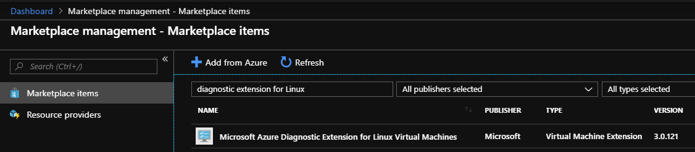
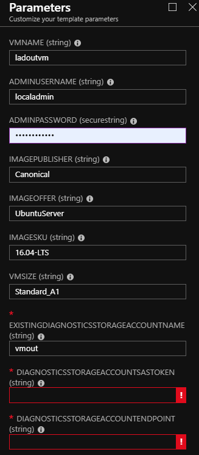
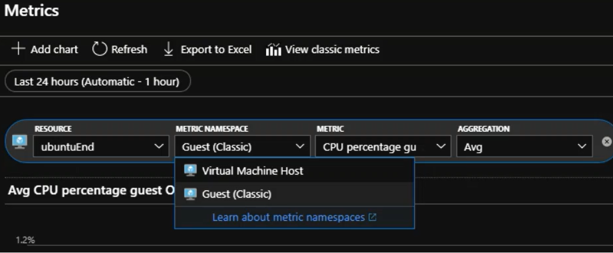
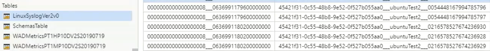

# Simple Linux VM with Diagnostic Settings

## Description

Deploys a simple Linux VM with Linux Diagnostic Extension (LAD). This template also deploys a Virtual Network (with DNS), Network Security Group, and a Network Interface.

`Tags: [Linux]`

## Prerequisites

- Create an Azure/AzureStack storage account for recorded metrics and logs.
- Acquire SAS token of above storage account.
- [Prepare Linux VM image](https://docs.microsoft.com/en-us/azure-stack/operator/azure-stack-linux?view=azs-1908).
- For AzureStack 1908 or eariler, download LAD image from marketplace. 

## Deploy

1. Login to AzureStack portal
2. Click 'Create a resource' -> 'Get started' -> 'Template Deployment'
3. Copy content in azuredeploy.json, click 'Edit Template', paste all the content and click 'Save'
4. Fill in the [parameters](#Parameters)
5. Click 'Create'

## Parameters

- existingdiagnosticsStorageAccountName: The storage account you prepared.
- diagnosticsStorageAccountSasToken: The [SAS token](https://docs.microsoft.com/en-us/rest/api/storageservices/create-account-sas?redirectedfrom=MSDN) with write permission you created.
- diagnosticsStorageAccountEndPoint: The storage account endpoint. You can get it from `Properties` blade of storage account, generally equals to substring of `Primary Blob Service Endpoint` after "blob.".

## Output

After a while, you can view the VM metrics on Azure Monitor blade by selecting the VM and the Guest namespace. 

You can get logs from table “LinuxSyslogVer2v0” in the storage account you specified.