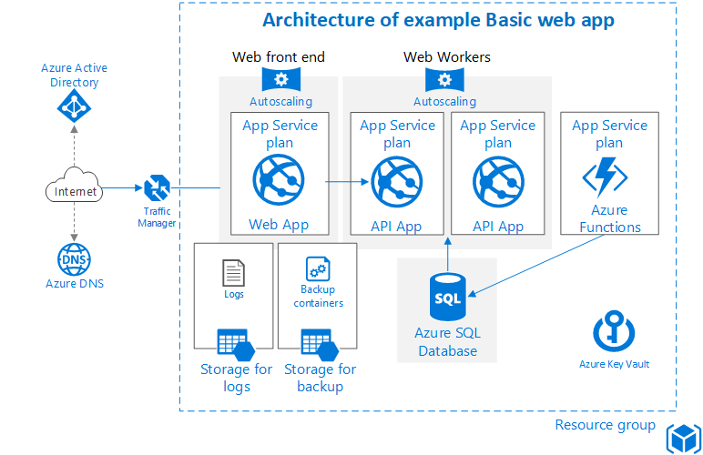

# GDPR Compliant Simple Web Application template
 
 This template deploys the following infrastructure components to deploy and host a simple Web Application:
* SQL Server database 
* WebApp (with AppService Plan)
* ApiApp (with AppService Plan)
* FunctionApp 
* KeyVault (part of Azure Stack base components)
* Storage Account
 These components are perfect starting point for preparing infrastructure components for your software solution that needs to comply with GDPR regulations:
* SQL Server database is stored on Bitlocker encrypted blob storage
* WebApp and ApiApp can be limited to only work in specific virtual networks (API App to communicate between frontend and backend using standard REST API functionality. API App is retrieving data from SQL database and provides it to WebApp frontend application)
   * Inside Web App and API app additional features was set:
    1. Virtual network
    
       When using the Standard or Premium App Service plan, you can connect your apps to an Azure virtual network. We use VNet Integration, where you don't need to expose a public endpoint for applications. Other possibilities are hybrid connections, Azure CDN or IP Restrictions. Thanks to using VNet Integration we can control Network Security Groups for that VNet.
       
    2. Managed service identity
    
       An app can use its identity to get tokens to other resources protected by AAD, such as Azure Key Vault. These tokens represent the application accessing the resource, and not any specific user of the application.
 * KeyVault can be used for storing sensitive information: SSL certificates, connection strings, etc. It also enables to track events and log activites.
* Storage Account can be used with App Service for scheduled backup and restoring functionality of application files, as well as configuration and backup of the database connected to and application.
 ## Prerequisites
 This template requires the following Resource Providers installed in your Azure Stack deployment:
* SQL Server Resource Provider
* Azure App Service
 ## Deployment steps
There are various ways of deploying this template:
1. You can use the Azure Stack portal utilizing a custom deployment
2. You can use Visual Studio utilizing azuredeploy.json and azuredeploy.parameters.json.
3. You can deploy the template by using PowerShell
