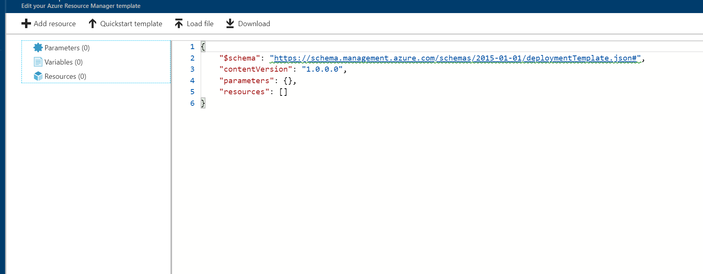
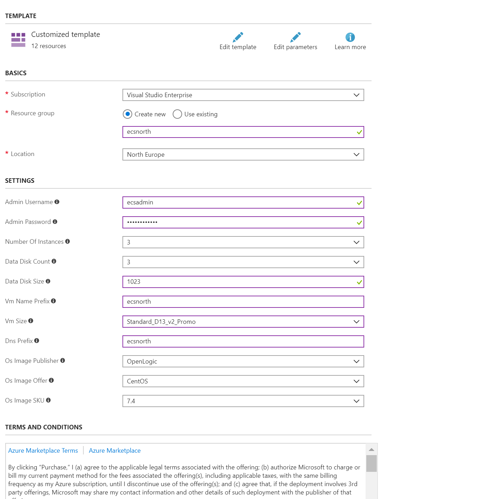
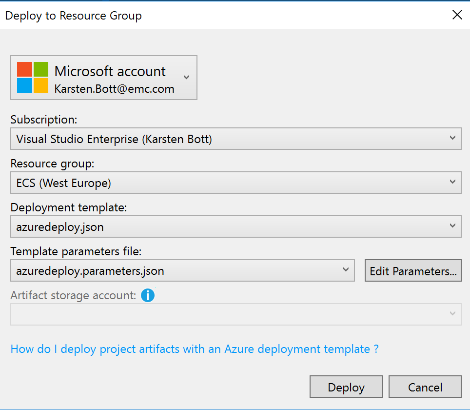
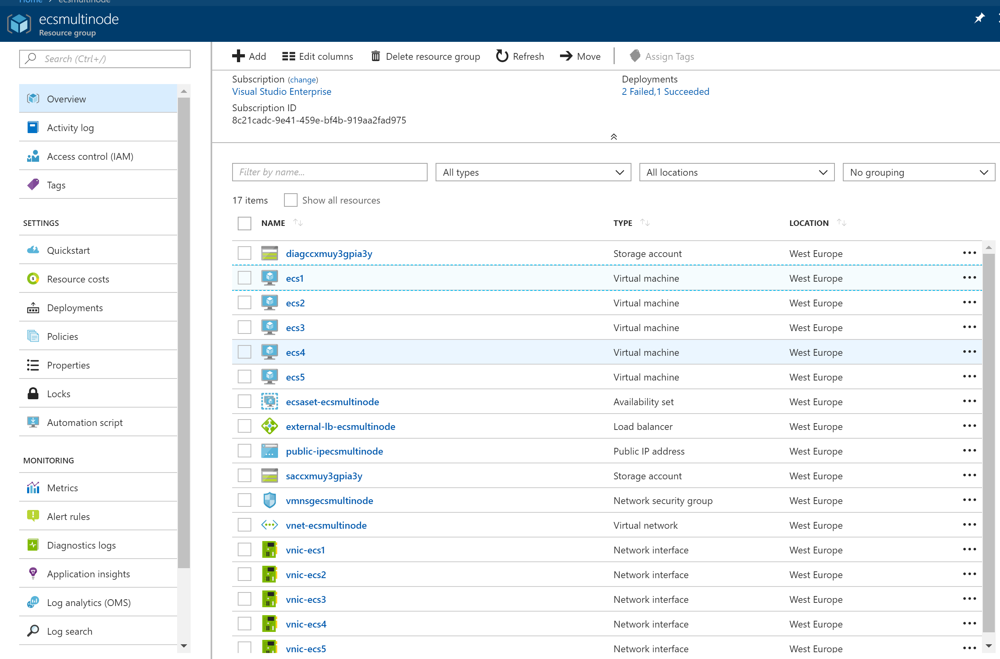
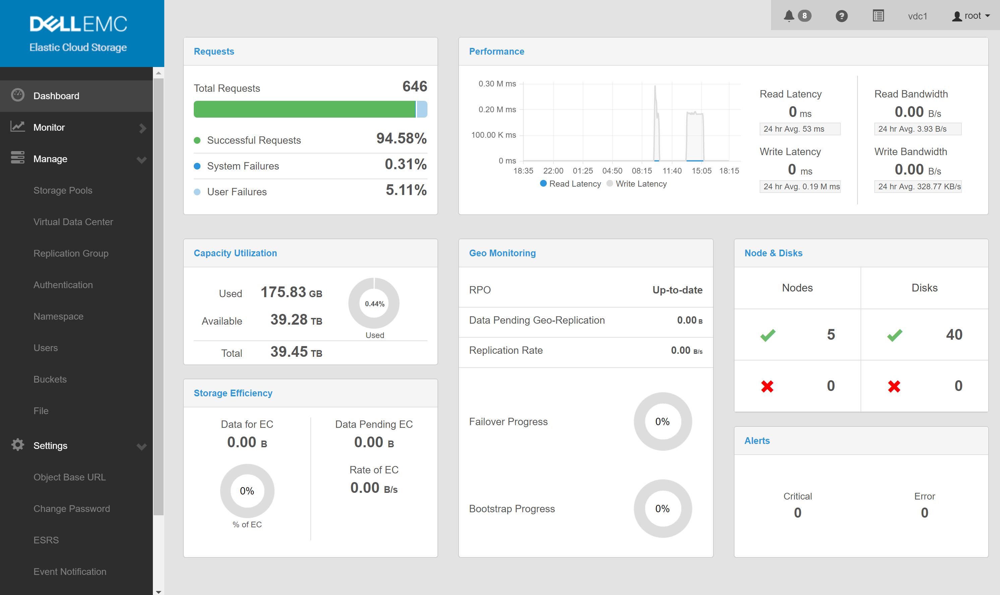

# multinode dellemc ecs community edition in an azure availabilty set

<a href="https://portal.local.azurestack.external/#create/Microsoft.Template/uri/https%3A%2F%2Fraw.githubusercontent.com%2Fbottkars%2Fazurestack-quickstart-templates%2Fkb-dev%2F301-availability-set-elastic-storage-ecs%2Fazuredeploy.json" target="_blank">

</a>
<a href="http://armviz.io/#/?load=https%3A%2F%2Fraw.githubusercontent.com%2Fbottkars%2Fazurestack-quickstart-templates%2Fkb-dev%2F301-availability-set-elastic-storage-ecs%2Fazuredeploy.json" target="_blank">

</a>

To deploy this template using the scripts from the root of this repo: (change the folder name below to match the folder name for this sample)

```PowerShell
.\Deploy-AzureResourceGroup.ps1 -ResourceGroupLocation 'local' -ArtifactsStagingDirectory '301-availability-set-elastic-storage-ecs'
```
```bash
azure-group-deploy.sh -a '301-availability-set-elastic-storage-ecs' -l local
```

This template deploys a **multinode dellemc ecs community edition**. The **ecs community edition** is a **elastic cloud storage solution providing object storage (sr, atoms, cas)**

`Tags: arm, centos, ecs, ecs community edition`

## Solution overview and deployed resources

This is an overview of the solution

The following resources are deployed as part of the solution

#### Storage Accounts 

Storage ressources provided per vm

+ **vm storage account**: holds the os copy from image (CentOS) and up to 8 data disks per node
+ **diagnostic storage account**: storage for vm diagnostics

#### Supported OSimage Publisher / SKU /Versions
the following images are supported:
+ **CentOS** this is based on the RogueWave Centos Image using Publicher OpenLogic, SKU CentOS, Version 7.4
+ **CentOS-7** this is based on the original Centos CloudImage using Publisher CentOS, SKU Centos-7, Version Centos-7.4 
The Centos-7 must be loaded manually or using [Azurestack-Kickstart](https://github.com/bottkars/Azurestack-Kickstart)

#### networkSecurityGroups

Firewall rules for Network

#### networkLoadbalancer
Public loadbalancer for ECS Nodes
+ **lbRulesA**: Load Balancing rules for ECS Ports 111,2049,9020.9021,9022,9023,9024,9025,10000
+ **inboundNatRules**: ports 220x are forwarded to port 22 on NodeX

#### OSTCExtensions
Custom Script Extensions for Linux
The deployment utilizes the custom script extension 
+ **configurenode**: Used on the Node to configure installer Prerequirements, used on nodes 2-N
+ **install_ecs**: the ecs installer, run´s on node 1

Password Change extension
the Deployment utilizes the Password change extension for linux
+ **resetpassword** to overcome some issues where cloudinit does not accept password
the default password is Subscription#**id**, example Subscription#8c21cadc-9e41-459e-bf4b-9b5aa2fad938
## Prerequisites
The required VM Types need to have at least 4vCPU and 16GB memory.
Depending on your Subscription, you may require to increase your arm quota vor cores.  
also notice that some vm types are not available in some regions, specially the promo ones.

## Deployment steps

### deploy to Azure from this site
You can click the "deploy to Azure" button at the beginning of this document or follow the instructions for command line deployment using the scripts in the root of this repo.
the parameters section will be the same 

### from new azure template from azure portal
From the azure Portal, click new and type in template.
select the new custom template dialog

  


once open, click on the upload and load the azuredeploy.json

  


fill in all parameters to you need and make sure the dns prefix is not used 
  
### quickstart template 


Also, you can use Visual Studio to deploy the template. If you have installed the ressourcegroup extensions creater a new deployment and select '301-availability-set-elastic-storage-ecs' from the quickstart templates


### visual studio example



#### parameters of resource group


The ressource group deployment will take between 10 and 15 Minutes, depneding on VM Types



once the resource group deployment has finished, the ecs installer will be started from
[ecs.sh](emcecs/ecs.sh)

#### monitor installation
ssh into the first node (use the external dns name ), port 2201
```bash
sudo su
tail -f /root/install.log
```

the system will do a reboot after package installation.
the reboot(s) will be controlled by a systemd service [ecs-installer.service](emcecs/ecs-installer.service)

after the reboot, the ECS ansible installer starts withn step1 and step2  
the progress is also logged 
```bash
sudo su
tail -f /root/install.log
```


#### Connect

once the installation has finished step2, you can connect to port 443 of your externa DNS from a webbrowser. 
the initial user / password is root:ChangeMe




#### Management

For more information, see
[DellEMC ECS Community Edition readthedocs](http://ecsce.readthedocs.io/en/latest/installation/ECS-Installation.html)

and 
[DellEMC ECS Documentation](https://community.emc.com/docs/DOC-56978)

## Notes

future improvement´s
+ feedback of installation logs to arm
+ ubntu based install ( pending verification )
+ singlenode from same deployment
+ nested template for loadbalancer as copy set