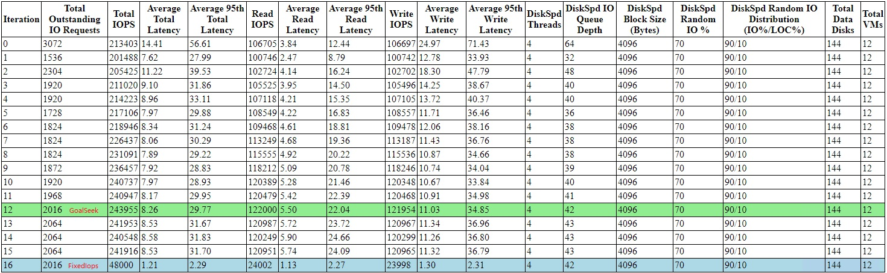
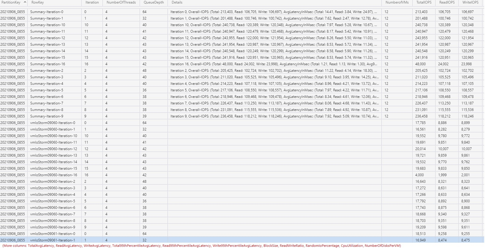

# IoStorm for AzureStack

## Prerequisites
PowerShell version: 5.0 <br>
PowerShell modules: AzureRM 2.5.0, AzureStack 1.7.2

To avoid conflicts or breaking changes, we recommend that you reinstall them from PowershellRepo_AzureStack_2.5.0_RC:
```PowerShell
# Unzip PowershellRepo_AzureStack_2.5.0_RC.zip
$packagePath = "The path to PowershellRepo_AzureStack_2.5.0_RC" # e.g."C:\TestArtifacts\Workloads\PowershellRepo_AzureStack_2.5.0_RC"

# Register repository
Register-PSRepository -Name AzureStackHubAzureRM250 -SourceLocation $packagePath -InstallationPolicy Trusted

# Uninstall the existing Azure Resource Manager and Az PowerShell modules
Get-Module -Name Azure* -ListAvailable | Uninstall-Module -Force -Verbose -ErrorAction Continue
Get-Module -Name Azs.* -ListAvailable | Uninstall-Module -Force -Verbose -ErrorAction Continue
Get-Module -Name Az.* -ListAvailable | Uninstall-Module -Force -Verbose -ErrorAction Continue

# Install the required modules
Install-Module -Name AzureRM -Repository AzureStackHubAzureRM250 -AllowClobber -Force
Install-Module -Name AzureStack -Repository AzureStackHubAzureRM250 -AllowClobber -Force
```

OS Image: (You can get them from marketplace.) <br>
WindowsServer-2016-Datacenter Or WindowsServer-2019-Datacenter

## Mode
| IoStorm Mode | Behavior Description |
| :-----:| :---- |
| GoalSeek | (Default) IoStorm will fully automatically adjust the IO Workload to reach the maximum IOPS under the given maximum P95 latency. You can use this mode and its output to benchmark your stamp. |
| FixedIops | IoStorm will not adjust the IO Workload, and you have to specify the parameters to control workload. |
| GoalSeekFixedIops | IoStorm will first run the GoalSeek mode to obtain the appropriate IO queue depth (this is useful if you don’t know how to set the queue depth for a fixed IOPS), and then limit the workload IOPS to the specified value, you can monitor the latency (or other performance) in the fixed IOPS workload. |

## Parameters
### Mandatory Parameters
They are used to log in to Admin ARM.
| Name | Type | Sample | Description |
| :-----:| :----: | :---- | :---- |
| ARMEndpoint | string | "https://management.DomainFqdn" | The ARM endpoint. |
| AdminCredential | PSCredential | $(Get-Credential) | The credential used to log in to ARM. |
| TenantId | string | xxx-xxx-xxx-xxx-xxx | The tenant Id used to log in to ARM. |

### Optional Parameters
#### Input / Output
They are used to specify the location of the test tools and the location where the test output is stored.
| Name | Type | Sample | Description |
| :-----:| :----: | :---- | :---- |
| ResourcePath | string | C:\IoStorm | The location of test scripts, configuration files, and tools. The default value is the path of the IoStorm module. |
| OutputPath | string | C:\IoStormOutput | The location of test output and logs. The default value is `.` (the current PS workspace). |
| ResourceGroup | string | IoStorm0901 | The resource group used to deploy IoStorm workloads. The dafault value is `"IoStorm$($startDate.ToString('MMdd'))"`. |
| OutputResourceGroup | string | IoStormOutput | The resource group used to deploy storage account for test results. The default value is to use the same value as `ResourceGroup`. |
| OutputStorageAccountName | string | iostormoutsa09010101 | The torage account used to store the test results. The default value is `"iostormoutsa$($startDate.ToString('MMddhhmm'))"`. |
#### Workload VM
They are used to specify the size of the workload VM/disk. Most of them can be calculated automatically based on the size of the stamp (recommended).
| Name | Type | Sample | Description |
| :-----:| :----: | :---- | :---- |
| VMCount | int | 20 | The number of workload VMs, if you set it to 0 (default), it will be calculated automatically. |
| VMSize | string | Standard_DS3_v2 (default)  | The size of the workload VM. |
| DataDisks | int | 12 (default) | The number of data disks per worload VM, should less than the max number of data disks for the VM size. |
| DataDiskSizeInGB | int | 128 | The data disk size, if you set it to 0 (default), it will be calculated automatically. |
| StorageUsagePercentage | int | 60 (default) | The percentage of remaining storage used to create data disks. (10 % - 90 %) |
| VMOsSku | string | 2016-Datacenter (default) | The OS Sku of the workload VM, only support `2016-Datacenter` and `2019-Datacenter` |
#### Workload
They are used to control the IO workload. 
| Name | Type | Sample | Description |
| :-----:| :----: | :---- | :---- |
| VMIoMaxLatency | int | 30 (default) | The maximum acceptable P95 latency value (milliseconds) from the perspective of the application, it's used in GoalSeek mode. |
| FixedIops | int | 4000 | The fixed IOPS (per VM), if you set it to 0 (default), the fixed IOPS mode will not run. |
| IoMinQueueDepth | int | 1 (default) | The lowest queue depth value used for DiskSpd, it will be automatically adjusted in GoalSeek mode. |
| IoThreads | int | 4 | The number of threads value used for DiskSpd, if you set it to 0 (default), it will be calculated automatically. |
| IoDurationInSec | int | 600 (default) | The IO Duration used for DiskSpd, it determines how long an iteration takes. |
| IoBlockSizeInBytes | int | 4096 (default) | The IO block size used for DiskSpd. |
| IoWritePercentage | int | 50 (default) | The percentage of write IO used for DiskSpd. |
| IoRandomIoPercentage | int | 70 (default) | The percentage of random IO (others are sequential) used for DiskSpd. |
| IoRandomIoDistribution | string | 90/10 (default) | A string used to describe (*) the distribution of random IO for DiskSpd, if you don't want to control the random io distribution, please set it to `$null`. |

\* Example of `IoRandomIoDistribution`:<br>
Example 1: `90/10` - 90% of IO to the first 10% of target, 10% to the next 90% of target (implied), it is used to simulate hot/cold data. <br>
Example 2: `90/10:5/50` - 90% of IO to the first 10%, 5% to the next 50%; tail of 5/40 implied. <br>
Example 3: `90/10:0/10:5/20` - 90% of IO to the first 10% of the target, no IO to the next 10% of the target, 5% IO to the next 20% of target, and the remaining 5% of IO to the remaining 60% of target (implied).
#### Others
| Name | Type | Sample | Description |
| :-----:| :----: | :---- | :---- |
| RestartRun | bool (switch) | false (default)  | Skip the deployment and reuse the previous VM/Disk, you must specify `ResourceGroup` |
| SkipCleanUp | bool (switch) | false (default) | Skip the cleanup of resources in the `ResourceGroup` at the end of the test. |
| RunFixedIoLatencyTestAfterGoalSeek | bool (switch) | false (default) | It is used to run GoalSeekFixedIops mode if you set `FixedIops`. |

## Example
### Start IoStorm
```PowerShell
$ARMEndpoint = "https://management.DomainFqdn"
$AdminCredential = Get-Credential
$TenantId = "xxx-xxx-xxx-xxx-xxx"

Import-Module .\IoStorm.psm1

# GoalSeek mode
Start-IoStorm -ARMEndpoint $ARMEndpoint -AdminCredential $AdminCredential -TenantId $TenantId

# FixedIops mode
Start-IoStorm -ARMEndpoint $ARMEndpoint -AdminCredential $AdminCredential -TenantId $TenantId -FixedIops 4000 -IoMinQueueDepth 16

# GoalSeekFixedIops mode
Start-IoStorm -ARMEndpoint $ARMEndpoint -AdminCredential $AdminCredential -TenantId $TenantId -FixedIops 4000 -RunFixedIoLatencyTestAfterGoalSeek
```
### Results
#### Local
Results and logs will be stored in a lock folder named `IoStormMMddHHmm` under `OutputPath`. <br>
\- IoStormMMddHHmm <br>
|\- IoStormResults.html (A web page showing the overall summary results of all iterations.) <br>
|\- IoStormResults.txt (A text file showing all aggregated DiskSpd results for each workload VM of all iterations.) <br>
|\- IoData.csv (A CSV file showing all overall aggregated results of all GoalSeek iterations.) <br>
|\- FixedIoData.csv (A CSV file showing all overall aggregated results of all FixedIops iterations.) <br>
|\- IoStormStatus.txt (A text file showing the final status and results of this test run.) <br>
|\- IoStormController.txt (The trace log of Start-IoStorm.) <br>
|\- Logs <br>
&nbsp;&nbsp;&nbsp;|\- iopresyncstart.txt (A text file showing the pre-sync action from the controller.) <br>
&nbsp;&nbsp;&nbsp;|\- iopresync <br>
&nbsp;&nbsp;&nbsp;&nbsp;&nbsp;&nbsp;|\- IOPreSync-vm*.txt (A text file showing the pre-sync status from the workload VM.) <br>
&nbsp;&nbsp;&nbsp;|\- ioworkloadstart-* (A file showing the workload config for this iteration from the controller.) <br>
&nbsp;&nbsp;&nbsp;|\- ioresult <br>
&nbsp;&nbsp;&nbsp;&nbsp;&nbsp;&nbsp;|\- iteration-* <br>
&nbsp;&nbsp;&nbsp;&nbsp;&nbsp;&nbsp;&nbsp;&nbsp;&nbsp;|\- IOResult-vm*.xml (The DiskSpd output of this iteration from the workload VM.) <br>
&nbsp;&nbsp;&nbsp;|\- logs <br>
&nbsp;&nbsp;&nbsp;&nbsp;&nbsp;&nbsp;|\- VMWorkload-vm*.txt (The trace log of the IoStorm worklaod task from the workload VM.)<br>


#### Cloud Storage
Results and logs will be stored in storage account `OutputStorageAccountName` under resource group `OutputResourceGroup` <br>
##### Table
Name: IoStormResultsMMddHHmm <br>
PartitionKey: yyyyMMdd_HHmm <br>
RowKey: <br>
Summary-Iteration-* (Include all overall aggregated results of this iteration.) <br>
vm*-Iteration-*  (Include all aggregated DiskSpd results of this iteration from the workload VM.) <br>

##### Blob
Container Name: iostormresultsMMddHHmm <br>
Blobs: (the content is the same as local.) <br>
IoStormController.log <br>
IoStormResults.html <br>
IoStormResults.log <br>
