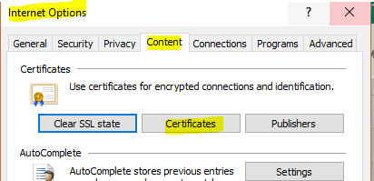
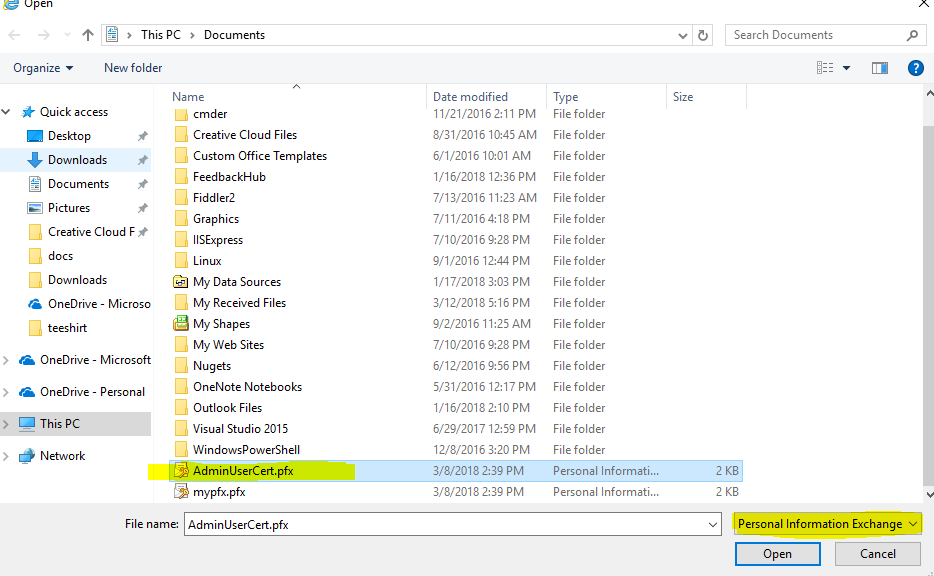
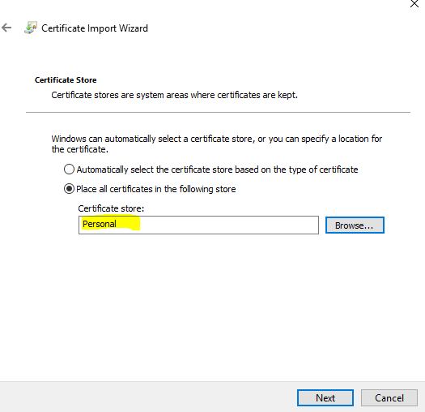
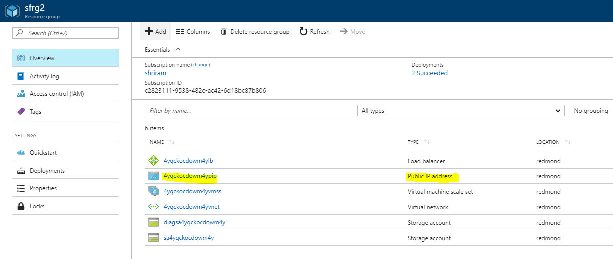
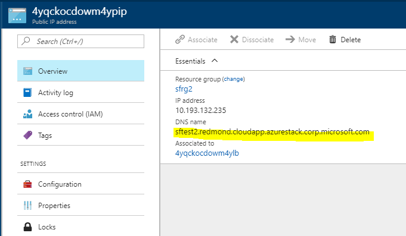
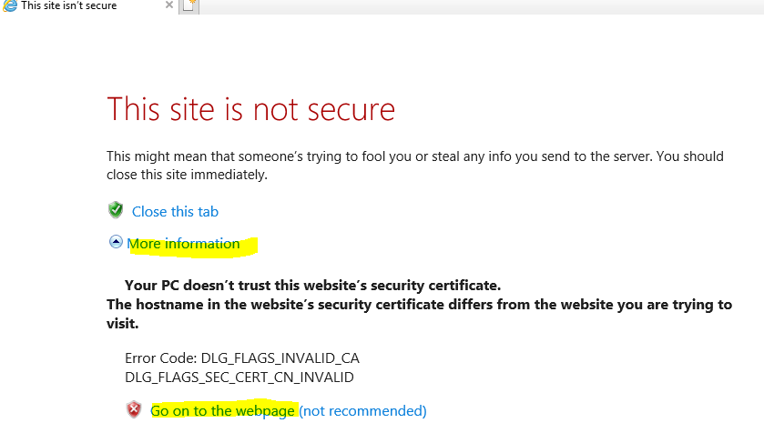
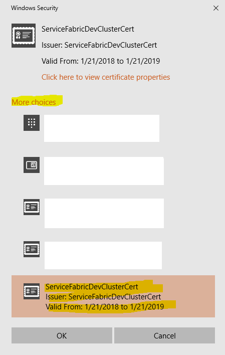
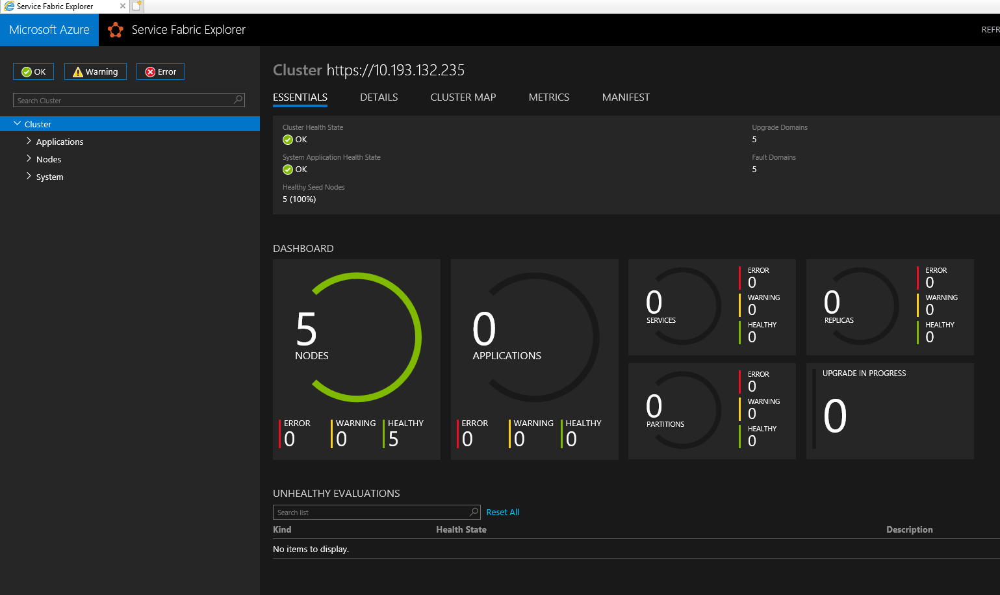
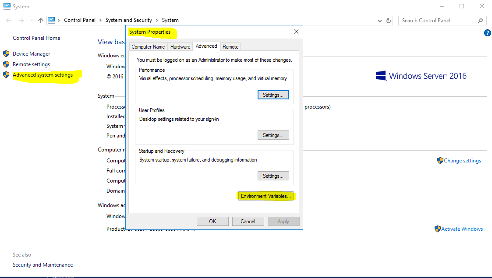
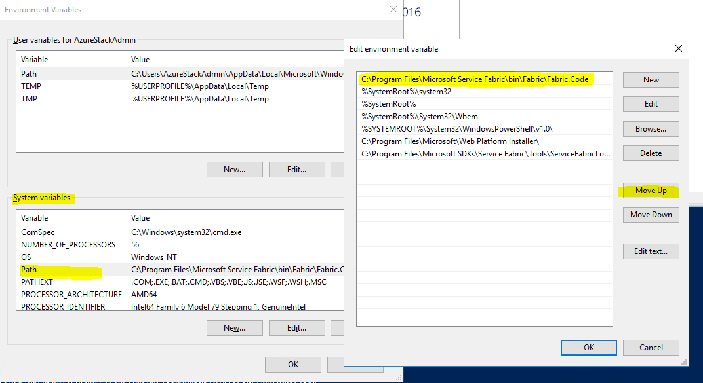

# Accessing the Service Fabric Cluster
You can access the SF cluster either through the Service Fabric Explorer or the Service Fabric PowerShell cmdlets.

## Access SF cluster through SF explorer
1.	First, you need to make sure the Browser has access to your Admin client certificate to authenticate to your SF cluster. To do this, open Internet Explorer  and go to **Internet Options -> Content -> Certificates**

    
    
    Click on Import, go through the Certificate Installation wizard and select the **Admin Client certificate** you’d provided to the template 

    **Note: This is different from the Cluster certificate you uploaded to KV.** 
    
    Ensure that you have “Personal Information Exchange” selected in the extension dropdown of the File Explorer window.

    
    
    Ensure that the certificate goes to the **Personal Cert Store**
    

2.	Find out the FQDN of your SF cluster by clicking the Public IP Address resource in your SF Cluster Resource Group

    

    This should open the Public IP address blade with the FQDN displayed on it

    

3.	Go to https://<**FQDN>**:19080  (**Note the Https in front of the FQDN**). 
    If you’ve used a self signed certificate, you’ll get a warning that the connection is not secure. If you get it, click **More Information -> Go on to the webpage**
    

4.	Select the certificate to use to authenticate to the site. Click on More Choices and pick the right cert and hit **OK**

    

5.	You should now be able to access the SF Explorer
    

## Access SF cluster through SF PowerShell
1. Install Service Fabric SDK from [here](https://docs.microsoft.com/en-us/azure/service-fabric/service-fabric-get-started). This should open Web Platform Installer to install SF tools on your machine
2. **[Temporary workaround]:** Once the installation is completed, You need to make sure that the SF cmdlets are accessible from PowerShell
    - To do this, Open System properties and select **Environment variables**
    
    - Edit the Path variable from System Variables and make sure that _“C:\Program Files\Microsoft Service Fabric\bin\Fabric\Fabric.Code”_ is on the top of that list. Use the Move Up button to bring it up to the top
    

3. Restart PowerShell (or ISE) and run the following cmdlet after replacing the appropriate value for [SF CLUSTER FQDN]. This should give you access to your SF cluster.
    ```
    Connect-ServiceFabricCluster -ConnectionEndpoint "[SF CLUSTER FQDN]:19000" `
    -X509Credential -ServerCertThumbprint 761A0D17B030723A37AA2E08225CD7EA8BE9F86A `
    -FindType FindByThumbprint -FindValue 0272251171BA32CEC7938A65B8A6A553AA2D3283 `
    -StoreLocation CurrentUser -StoreName My -Verbose 
    ```
    **Note: There should be no https:// before the cluster name**

# Next Steps
* [Creating and Deploying applications to a Service Fabric Cluster](https://docs.microsoft.com/en-us/azure/service-fabric/)
