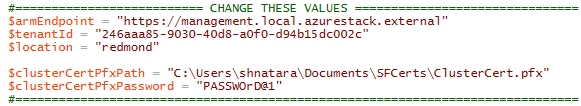
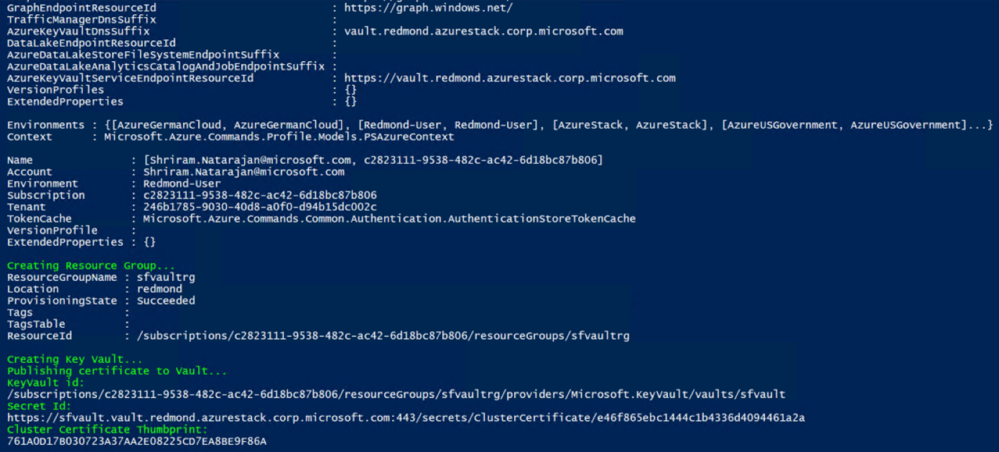
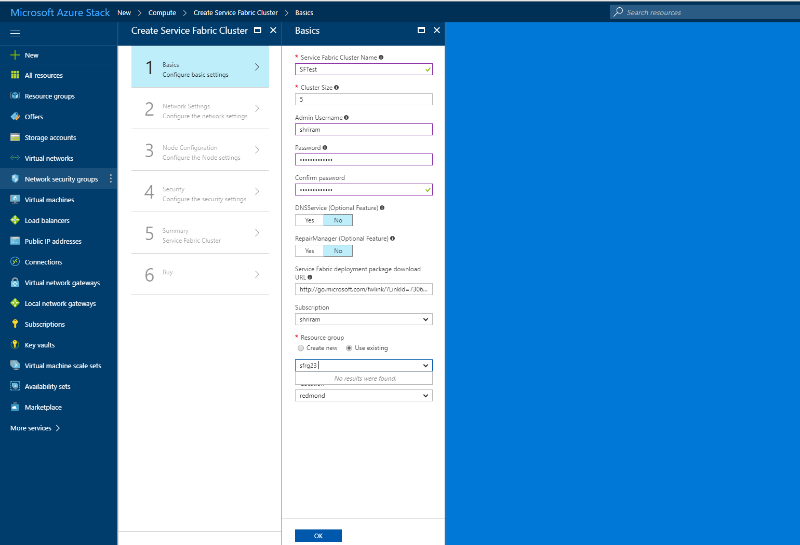
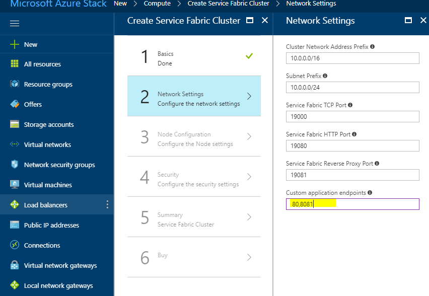
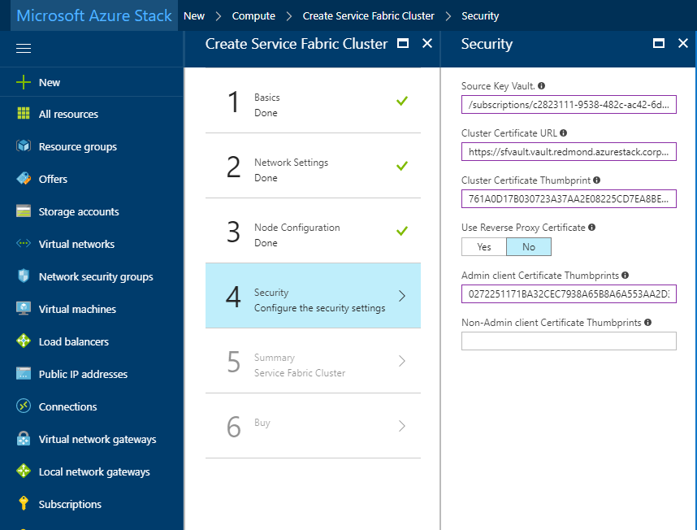

This item will deploy a secured Service Fabric Cluster. For more information, see [Service Fabric Cluster Security](https://docs.microsoft.com/en-us/azure/service-fabric/service-fabric-cluster-security).
# Prerequisites

1.	Cluster certificate – this is the server-side certificate. The CN on this cert needs to match the FQDN of the SF cluster being created. The cert needs to be a Pfx i.e. should contain its private key. See [requirements](https://docs.microsoft.com/en-us/azure/service-fabric/service-fabric-cluster-security) for creating this server side cert.
Note: Self-signed certs can also be used for testing purposes and don’t have to match the FQDN

2.	Admin Client Certificate – this is the certificate that the client will use to authenticate to the SF cluster. This can be self-signed. See [requirements](https://docs.microsoft.com/en-us/azure/service-fabric/service-fabric-cluster-security) for creating this client cert.

3.	Windows Server 2016 image in Azure Stack Marketplace – the template uses the Windows Server 2016 image to create the cluster. You can download this from Marketplace Syndication.

# Installation Steps:
## Azure Stack Operator
- Download the Service Fabric Cluster (Preview) item from Marketplace management. 
You should now see the Marketplace item in your Azure Stack Marketplace under Compute.

## User

- Create a Key Vault and add a secret to it:

    **NOTE: DO NOT DO THIS FROM THE UI. There is a known bug about uploading certs into a KV through UI.**

    The template takes a KeyVault as input and retrieves the Cluster certificate from it during installation. For more information, see [Manage KeyVault on Azure Stack with PowerShell](https://docs.microsoft.com/en-us/azure/azure-stack/user/azure-stack-kv-manage-powershell). 
    We’ve provided a useful [helper script](scripts/Publish-SecretToVault.ps1) to do this.

    - After you create a certificate, modify the input parameters on this script to help login and create the vault and add the cert to it
    - This script will also output the values you need to provide the template

- Deploy the Marketplace item

    - Go to the Portal and find the Service Fabric Cluster item from the Marketplace under compute and click on it. Fill out the deployment form appropriately – Use the defaults if you’re not sure of the values 
    

    You can also specify specific ports to open for your applications under the Network Settings step.
     
    
    In the Security Step, replace the values you obtained from creating the Azure KeyVault and Uploading the Secret in the previous step.
    
    For the Admin Client Certificate Thumbprint, enter the thumbprint of the Admin Client certificate (See the [Prerequisites](#Prerequisites) section).
     

Go through the rest of the wizard and click on Purchase to kick off the deployment.

# Next Steps
* [Access your Service Fabric Cluster](accessSFCluster.md)